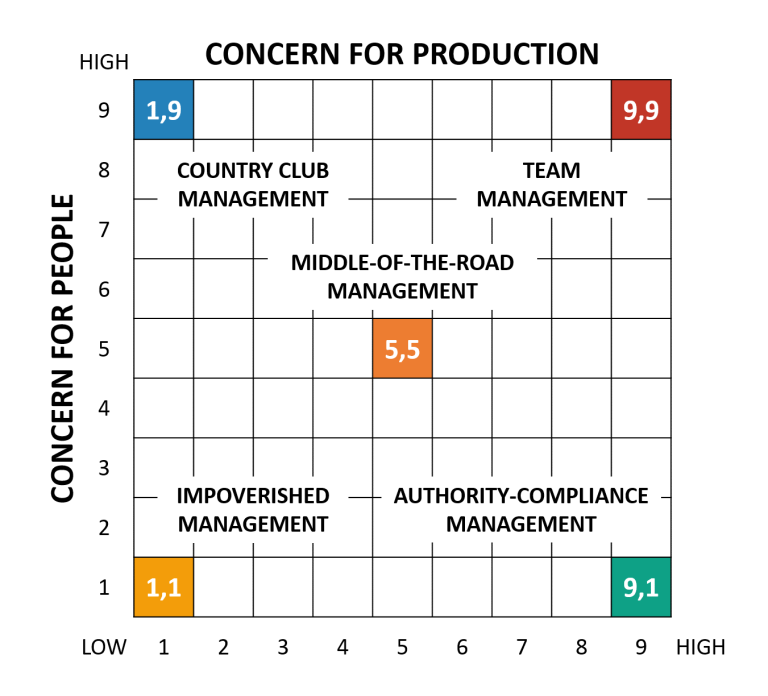

<h1 align="center" style="color:Navy;">Organizational Behaviour</h1>
<h2 align="center" style="color:DarkRed;">Week-10 (Power and Leadership)</h2>

If motivation is center to the individual dynamics in OB.   
Leadership and Power is center to the interpersonal dynamics in OB.     
Power and Leadership are interconnected.    
A leader is the one who has the power.

# <b>Power</b>

- Power refers to the ability to influence others.
- It involves the capacity to change the behavior or attitudes of people in a desired way.
- Power can be exerted gently and is not always associated with force or dominance.
- Individuals at all levels, even in lower positions, possess power in various forms.

## <g>Sources of Power</g>

<smb>1. **Legitimate Power**</smb> :- based on formal position  
   **Definition**: Power that comes from a person's formal position or role in an organization, giving them authority over others.  
   **Example**: A manager instructs their team to complete a project by the end of the week. The team follows the directive because of the manager's position.

<smb>2. **Coercive Power**</smb> :- capacity to administer punishment to others  
   **Definition**: The ability to impose penalties or consequences to influence others' actions.  
   **Example**: A supervisor warns an employee that they will be suspended if they continue to miss deadlines.

<smb>3. **Reward Power**</smb> :- capacity to administer reward to others  
   **Definition**: Power that comes from the ability to provide rewards, such as bonuses, promotions, or other incentives.  
   **Example**: A team leader offers a day off to the employee who performs the best during a particular project.

<smb>4. **Expert Power**</smb> :- based on skills and abilities  
   **Definition**: Power that comes from having specialized knowledge or skills that others value and depend on.  
   **Example**: A software developer with advanced coding skills is relied upon by their peers to solve complex technical problems.

<smb>5. **Referent Power**</smb> :- the degree to which one is liked and admired by others  
   **Definition**: Power that comes from being liked, admired, or respected, leading others to follow or emulate the person.  
   **Example**: A popular movie star is followed by million of fans - fan following is power here.
    

## <g>Empowerment</g>

Usually in organizations, the power is distributed in a triangle or pyramid shape.    
More power at the top, less power at the bottom.    

**Empowerment** is the process of sharing power with others to increase their confidence, autonomy, and capacity to make decisions. It focuses on cooperation and collaboration rather than control. When individuals or teams are empowered, they are entrusted with responsibilities, fostering a sense of ownership and engagement.

**Benefits of Empowerment**:  

   1. **Increased Motivation**: When individuals feel empowered, they are more motivated and engaged in their work.
   2. **Better Decision-Making**: Empowered individuals are encouraged to make decisions, leading to faster and more innovative solutions.
   3. **Higher Job Satisfaction**: Giving employees control over their tasks boosts their satisfaction and loyalty to the organization.
   4. **Improved Teamwork**: Empowerment promotes collaboration and trust among team members, improving overall team performance.
   5. **Personal Growth**: Individuals who are empowered often experience personal and professional development, acquiring new skills and confidence.

## <g>Organizational Politics</g>

Organizational politics refers to the unauthorized or informal use of power to enhance or protect one's self-interest, often at the expense of organizational goals or others within the organization.

**Forms of Political Behavior :**

1. **Manipulating Information Flow :-**  Controlling the flow of information to gain an advantage or mislead others.  
   **Example**: A manager selectively shares information with only certain team members to influence their decisions or perceptions **OR** Employee not sharing tacit knowledge to others.   

   > Tacit knowledge refers to the knowledge, skills, and abilities an individual gains through experience that is often difficult to put into words or otherwise communicate.

2. **Impression Management :-**  Deliberate actions aimed at influencing how others perceive you, often to create a favorable image.  
   **Example**: An employee consistently showcases their achievements in front of senior management to appear more competent than their peers.

3. **Building Coalitions :-**  Forming alliances with others to gain power or influence in decision-making processes.  
   **Example**: A group of employees teams up to push for a policy change that benefits them, even if it's not in the best interest of the entire organization.

4. **Blaming :-**  Shifting responsibility or fault onto others to protect oneself from negative consequences.  
   **Example**: An employee blames a co-worker for a failed project, even though it was a joint effort, to avoid looking bad **OR** Spreading bad news about someone through gossiping. 

5. **Creating and Using Reciprocity :-**  Offering favors or assistance with the expectation of receiving something in return, often creating a cycle of obligation.  
   **Example**: A manager grants a colleague's request, expecting that colleague to support them in future decisions or projects.

# <b>Leadership</b>

**Leadership** is an act to lead others to goal.   
The ability to persuade others to seek defined objectives enthusiastically.   
The process of influencing a group toward the achievement of goals.

## <g>Managers Vs Leaders</g>

Are all managers leaders? Not Necessarily   
**Leader** is a role where as **Manager** is a designation.

| Managers | Leaders |
| :-: | :-: |
| Administer and copy |  Innovation and originality |
| Maintain | Develop |
| Focus on systems & structure | Focus on people |
| Rely on control | Inspire trust |
| Short-range view - bottom line | Long-range view - the horizon |
| Ask how and when | Ask what and why |
| Accept the status quo | Challenge the status quo |
| Classic good soldier | own person |
| Do things right | Do the right things |
 

**The Nature of Leadership:**
- Leadership involves non-coercive influence.
- Leadership influence is goal oriented.
- Leadership requires followers.

## <o>Approaches to Leadership</o>

## <g>1. The Trait Approach to Leadership</g>

**The Great Person Theory**:  
The Great Person Theory suggests that great leaders are born with inherent traits that make them capable of leading others effectively. It emphasizes the idea that leadership is not learned but rather a result of possessing certain innate qualities **OR** To become a leader, a person has to pocesses the great leader qualities.

### Characteristics of a Great Leader:

1. **Leadership Motivation :-**  A great leader has a strong desire to lead and motivate others. They take initiative and are driven to guide their team toward success.  

2. **Flexibility :-**  Leaders must be adaptable and open to change. They can adjust their strategies and behavior based on the needs of the situation or the team.  

3. **Focus on Morality :-**  Great leaders have strong ethical principles and lead with integrity, fairness, and honesty. They set a moral example for their followers.  

4. **High Energy Level :-**  Effective leaders often possess high energy, enthusiasm, and stamina, which helps them inspire and energize others around them.  

5. **Self-Confidence :-**  A great leader has confidence in their abilities and decisions, inspiring confidence in others.  

6. **Role-Specific Knowledge :-**  Leaders need a deep understanding of the specific area in which they lead to make informed decisions and guide others effectively.  

7. **Multiple Domains of Intelligence :-**  Great leaders often demonstrate a range of intelligences—emotional, social, and cognitive—allowing them to understand, relate to, and influence others effectively.  

## <g>2. The Behavioural Approach to Leadership</g>

### <smb>1. Democratic Style</smb>

Encourages decision making from different perspectives.  
**Consultative :** process of consultation before decisions are taken.   
**Persuasive :** Leader takes decision and seeks to persuade others that the decision is correct

**Advantages:**   
- May help motivation and involvement
- Workers feel ownership of the firm and its ideas
- Improves the sharing of ideas and experiences within the business, but it can delay the decision making.

### <smb>2. Laissez-Faire Style</smb>

- 'Let it be' — the leadership responsibilities are shared by all
- Can be very useful in businesses where creative ideas are important
- Can be highly motivational, as people have control over their working life
- Can make coordination and decision making time-consuming and lacking in overall direction
- Relies on good team work and interpersonal relations

### <smb>3. Autocratic Style</smb>

- 'Dictatorship manner' — The leader makes all decisions unilaterally, with little to no consultation with the team.
- Employees are expected to follow the leader’s instructions without questioning.
- Typically used in environments where quick decision-making is crucial or when tasks require strict compliance.

### <smb>4. Paternalistic Style</smb>

- Leader acts as a ‘father figure’
- Paternalistic leader makes decision but may consult
- Believes in the need to support staff

## <g>The Blake Mounton Managerial Grid</g>

The **Managerial Grid** (also known as the **Leadership Grid**) is a model developed by **Robert R. Blake** and **Jane Mouton** in the 1960s to help assess and describe different leadership styles based on two key factors:

1. **Concern for People** (Y-axis):  
   The extent to which a leader considers the needs, interests, and personal development of team members when deciding how to accomplish tasks.

2. **Concern for Production** (X-axis):  
   The degree to which a leader emphasizes organizational efficiency, productivity, and achieving goals.

The grid is scored from 1 (low concern) to 9 (high concern) along both axes, resulting in the following leadership styles:

---

### <smb>1. **Impoverished Leadership (1,1)**</smb>
- **Low concern for people, Low concern for production**  
- Leaders who fall in this quadrant tend to avoid responsibility and decision-making, exert minimal effort to get the job done, and are mostly disengaged from both team needs and production goals.  
**Result**: Low team morale and poor organizational performance.

---

### <smb>2. **Country Club Leadership (1,9)**</smb>
- **High concern for people, Low concern for production**  
- This style is highly focused on creating a comfortable and friendly environment. The leader prioritizes the well-being and happiness of team members, often at the expense of achieving organizational goals.   
**Result**: Happy team members, but lack of direction and underachievement in productivity.

---

### <smb>3. **Authority-Compliance Leadership (9,1)**</smb>
- **High concern for production, Low concern for people**  
- This style is highly task-oriented, where the leader is focused on efficiency and results above all else. The leader provides clear instructions and expects employees to follow them strictly with little consideration for their well-being or input.
**Result**: High productivity in the short term, but risk of low morale and burnout among team members.

---

### <smb>4. **Middle-of-the-Road Leadership (5,5)**</smb>
- **Moderate concern for people, Moderate concern for production**  
- This style balances the need for both people and production, but without excelling in either area. The leader seeks compromise, aiming for acceptable performance and satisfaction rather than pushing for excellence.   
**Result**: Adequate performance, but neither outstanding results nor exceptional team satisfaction.

---

### <smb>5. **Team Leadership (9,9)**</smb>
- **High concern for people, High concern for production**  
- This is considered the ideal leadership style, where the leader is committed to both team members' personal and professional growth and to achieving high productivity. Leaders who adopt this style foster collaboration, trust, and shared responsibility, creating a motivated and high-performing team.  
**Result**: High morale, strong collaboration, and exceptional performance.

---

### <r>Key Takeaways:</r>

- The **Team Leadership (9,9)** is viewed as the most effective leadership style, as it strikes a balance between people and production, leading to high performance and job satisfaction.
- The model emphasizes that leadership effectiveness is about balancing concern for people with concern for results, and the ideal leadership style may depend on the situation.

## <g>Contingency Theories</g>

Contingency theories suggest that there is no single best way to lead or manage a team. Instead, the effectiveness of leadership depends on various situational factors. Here are key theories:

### <smb>1. Fiedler's Contingency Model</smb>

- This model argues that leadership effectiveness depends on the interaction between the leader's style and the situation. Leaders are either task-oriented or relationship-oriented, and the effectiveness of each style depends on the context.
  
- **Key Components**:
  - **Task Structure**: The degree to which the tasks and goals of a group are clearly defined. High structure means tasks are routine, while low structure involves ambiguous tasks.
  - **Leader-Member Relations**: The quality of relationships between the leader and team members, based on trust, respect, and confidence.
  - **Positional Power**: The authority granted to the leader by their position, such as the ability to hire, fire, or reward employees.

---

### <smb>2. Hersey and Blanchard's Situational Leadership Theory</smb>

- This theory suggests that effective leadership is based on the leader's ability to adapt their style according to the maturity and competence of the followers. Different situations call for different leadership approaches.
  
- **Leadership Styles**:
  - **Telling**: Leader gives specific instructions and closely supervises the work (appropriate when followers have low competence and low commitment).
  - **Selling**: Leader explains decisions and provides guidance while encouraging two-way communication (useful when followers have low competence but higher commitment).
  - **Participating**: Leader involves followers in decision-making and offers support (ideal when followers have the competence but lack confidence or commitment).
  - **Delegating**: Leader entrusts decision-making to followers with little supervision (used when followers are both competent and committed).

---

### <smb>3. Charismatic Leadership</smb>

Charismatic leadership is a leadership style where the leader’s charm, personality, and persuasive communication inspire and motivate followers. These leaders are often seen as dynamic, confident, and capable of rallying people around a vision.

- **Key Characteristics : Visionary, Confidence, Communication Skills, Influence through Inspiration, Personal Magnetism**
- **Example**: Martin Luther King Jr. was a charismatic leader who inspired change through his passionate speeches and vision for equality.

---

### <smb>4. Servant Leadership</smb>

- Servant leadership focuses on serving others and prioritizing the needs of employees, followers, or the community. A servant leader’s primary goal is to empower and support their followers, fostering their development and well-being.

- **Key Characteristics : Empathy, Focus on Growth, Stewardship, Selflessness, Building Community**
- **Example**: Mahatma Gandhi exemplified servant leadership by putting the needs of the people first, focusing on non-violence and empowerment for India’s independence.

---

### <smb>5. Path-Goal Theory</smb>

- This theory suggests that leaders are effective when they help their subordinates achieve their goals by providing direction and support. A leader’s role is to clarify the path to the goal and reduce obstacles.
  
- **Core Idea**: Subordinates will be motivated by a leader only to the extent that they perceive the leader as helping them achieve their personal and work goals.

**Funny Video:** [First Follower: Leadership Lessons from Dancing Guy](https://youtu.be/fW8amMCVAJQ?si=TZnO-GjX8XS54Zg_)

---

