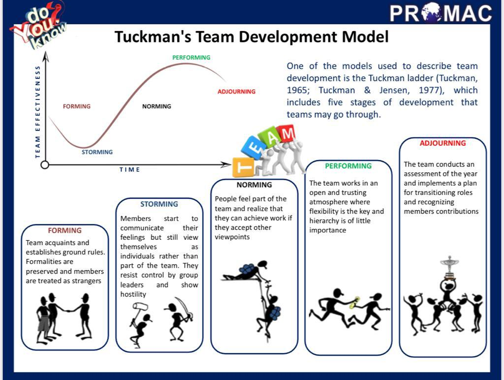

<h1 align="center" style="color:Navy;">Organizational Behaviour</h1>
<h2 align="center" style="color:DarkRed;">Week-11 (Group Dynamics)</h2>

## <g>Group</g>

- **Definition**: A group is any number of people who share common goals, often communicate with one another over a period of time, and are few enough so that each individual can interact directly with all the others on a person-to-person basis.
- **Purpose**: People form groups to fulfill various needs:
    - **Task Accomplishment**: Groups help achieve tasks that individuals cannot do alone.
    - **Security**: Being part of a group provides a sense of protection and stability.
    - **Affiliation**: Groups offer opportunities for social interaction and belonging.

## <g>What is a Team?</g>

- **Definition**: A team is a group of people working together cooperatively to achieve a shared goal.
- **Characteristics**:
    - A **special type of group** where members work **interdependently** towards a common objective.
    - Teams require **coordination** among members to succeed.
    - They are accountable for **shared outcomes**, particularly in the context of organizational goals.
- **Key Points**:
    - Teams are structured to **accomplish complex tasks** that require collaborative efforts.
    - Effective teams rely on **clear communication**, **role clarity**, and **shared responsibility**.

## <g>Differences Between Team and Group:</g>

- **General Distinction:** The distinction between a team and a group is not always clear-cut.
- **Key Viewpoints:**
    - **Teams in Work Settings:** Teams are structured groups of people working on well-defined, common goals.
    - **Coordination and Interaction:** Teams require coordinated interactions to accomplish tasks.
    - **Accountability:** Teams have a higher level of accountability compared to groups.
    - **Synergy:** Teams often exhibit a higher level of synergy, where collective efforts lead to better outcomes.
    - **Organizational Structure:** Teams are typically part of a larger organization.
    - **Assigned Roles:** Team members have specific, assigned roles based on their specialized knowledge, skills, and abilities.
    - **Limited Size:** Teams usually have a smaller, manageable size to ensure effective communication and collaboration.

## <g>Types of Teams:</g>

- **Production Groups:** Often semi-autonomous, supervisor-led teams focused on production tasks.
- **Service Groups:** Examples include airline attendant teams, maintenance crews, and customer service/sales teams.
- **Management Teams:** Responsible for various management functions within an organization.
- **Project Teams:** Typically cross-functional teams working on specific projects.
- **Action and Performing Teams:** Teams focused on quick decision-making and high-stakes performance (e.g., emergency response teams).
- **Advisory Teams:** Teams providing advice or recommendations (e.g., strategy or consulting teams).
- **Self-Managing Teams:** Teams that operate without direct supervision, managing their own tasks and goals.

## <g>Group Development Perspective</g>

- **Tuckman and Jensen Model (1977):** This model outlines five stages of group development that teams typically go through.

### 1. Forming
   - **Stage:** Orientation
   - **Description:** Group members get to know one another, and roles are still unclear. This phase is characterized by excitement and uncertainty as individuals explore the boundaries of acceptable behavior.

### 2. Storming
   - **Stage:** Conflict
   - **Description:** Disagreements and conflicts arise as group members challenge roles and procedures. Power struggles and tension may develop as individuals assert their perspectives.

### 3. Norming
   - **Stage:** Structure
   - **Description:** The group begins to establish norms, rules, and social relationships. Members start to cooperate, communicate more effectively, and develop trust within the team.

### 4. Performing
   - **Stage:** Work
   - **Description:** The group reaches a stage where they can effectively focus on the task at hand. Members collaborate and work towards achieving their goals, and productivity is high.

### 5. Adjourning
   - **Stage:** Dissolution
   - **Description:** The group completes the task, and the team disbands. This stage is marked by reflection on the group’s accomplishments and sometimes a sense of loss as the members part ways.

## <o>Problems in Teamwork</o>

## <g>Free Riding and Social Loafing</g>

- **Definition:** Free riding occurs when one or more members of a team contribute less effort than their colleagues, relying on others to accomplish the team's goals. Social loafing is a specific type of free riding where individuals exert less effort when they work in a group compared to when they work alone.
  
- **Causes:**
  - **Deindividuation:** Lack of individual accountability.
  - Perception that one's contribution won't make a significant difference.
  - Belief that others in the group will compensate for reduced effort.
  - **Sucker  aversion:**  refers to the reluctance of team members to contribute fully to a group task because they fear being exploited by others who may put in less effort, thus making them the "suckers" for doing most of the work.
  
- **Effects:**
  - Decreased overall productivity.
  - Lower team morale as members recognize unequal effort.
  - Inequitable distribution of workload within the team.

## <g>Conditions for Social Loafing</g>

1. **Large Team Size:**
   - When teams are too large, individual contributions become less noticeable, making it easier for members to reduce their effort without being held accountable.

2. **Perceived Low Instrumentality:**
   - Team members feel their individual effort does not significantly contribute to the team's success, leading to reduced motivation and effort.

3. **Low Trust:**
   - When members do not trust each other to contribute fairly, it can create a lack of accountability and encourage some to slack off.

4. **Perceived Low/Negative Valence:**
   - If individuals believe that the reward or outcome of the task is not valuable or meaningful to them, they are less likely to put in effort.

5. **Presence of an "Eager Beaver":**
   - A team member who consistently takes charge and does most of the work may unintentionally encourage others to contribute less, as they believe their input isn’t needed.

6. **Mundane Task:**
   - Repetitive, boring tasks that lack engagement or challenge can lead to low motivation, making members more likely to reduce their effort.

7. **Cultural and Individual Factors:**
   - Social loafing can be influenced by cultural norms or individual personality traits. For example, some cultures may emphasize collective effort, while others may prioritize individual achievement, impacting how much effort people put into group tasks.

## <g>Tackling Social Loafing</g>

1. **Increase Identifiability:**
   - Ensure that individual contributions are visible and measurable to reduce anonymity.
   - **Example Strategy:** Implement **weekly reporting** or regular check-ins where each team member is required to present their progress, making their contributions clear to others.

2. **Promote Involvement:**
   - Engage team members by assigning interesting and challenging tasks that match their skills and interests.
   - **Strategies:**
     - Design tasks that are **intrinsically motivating** to keep members engaged.
     - Foster a sense of **pride in membership** by emphasizing the team’s shared goals and success, making individuals feel valued.

3. **Reward Team Members for Performance:**
   - Provide recognition and rewards based on individual or team performance to encourage effort.
   - **Example:** Use **symbolic rewards** like public recognition, team awards, or certificates of appreciation that acknowledge contributions without necessarily relying on monetary rewards.

4. **Strengthen Team Cohesion:**
   - Build a sense of unity and belonging within the team to enhance motivation.
   - **Strategies:**
     - Encourage team-building activities to improve relationships and trust.
     - Cultivate a collaborative environment where members feel responsible for each other’s success, promoting a shared sense of accountability.

5. **Increase Personal Responsibility:**
   - Encourage team members to take ownership of their work by setting their own performance goals.
   - **Example Strategy:** Have individuals define their personal targets and make them accountable for achieving them, leading to greater commitment.

6. **Use Team Contracts:**
   - Develop **team contracts** where members agree on specific roles, responsibilities, and expected behaviors. This formalizes commitment and reduces ambiguity regarding what is expected from each member.

7. **Provide Internal Feedback Reviews:**
   - Establish internal feedback mechanisms within the team to review each other’s contributions.
   - **Strategy:** Implement regular **peer feedback reviews** where members evaluate each other's performance, offering constructive feedback and keeping everyone accountable.

8. **Maintain the "Right Size":**
   - Ensure the team is neither too large nor too small to promote effective collaboration.
   - **Why it Matters:** **Smaller teams** reduce the opportunity for social loafing by making individual efforts more visible, while also allowing for better communication and coordination.

## <g>Groupthink</g>

- **Definition:** Groupthink occurs when the desire for harmony or conformity in the group results in irrational or poor decision-making. In this scenario, group members prioritize consensus over critical evaluation of alternatives, leading to flawed outcomes.    

A type of thought exhibited by group members who try to minimize conflict and reach consensus without critically testing, analyzing, and evaluating ideas.

- **Causes:**
  - Strong group cohesion that discourages dissent.
  - Pressure to conform or avoid conflict within the group.
  - Overconfidence in the group’s capabilities, leading to disregard for external input or differing opinions.

- **Effects:**
  - Poor decision-making due to lack of critical analysis.
  - Suppression of alternative viewpoints and innovative ideas.
  - Increased risk of failure as the group becomes blind to potential risks or mistakes.

### <smb>Characteristics of Groupthink</smb>

1. **Illusions of Invulnerability:**
   - Group members develop an unrealistic sense of optimism and belief in the group's invincibility, which can lead to excessive risk-taking and overlooking potential dangers.

2. **Collective Rationalization:**
   - The group dismisses or rationalizes warnings and negative feedback that might challenge their decisions, reinforcing flawed thinking and discouraging alternative viewpoints.

3. **Unquestioned Belief:**
   - The group holds an unquestioned belief in the morality and correctness of their decisions, assuming that their collective actions are inherently just, regardless of potential ethical concerns.

4. **Stereotypical Views of Outsiders:**
   - The group creates negative stereotypes of outsiders or dissenting individuals, perceiving them as adversaries or as lacking knowledge, further insulating the group from external criticism.

5. **Direct Pressure on Dissenters:**
   - Members who express doubts or challenge the group's decisions face direct pressure or hostility, making it difficult for them to voice concerns, leading to conformity.

6. **Self-Censorship:**
   - Individuals within the group suppress their own doubts and reservations to avoid conflict, creating a false sense of agreement and unity within the group.

7. **Shared Illusion of Unanimity:**
   - Because dissent is either silenced or absent, the group believes there is unanimous agreement on decisions, reinforcing the collective confidence even if some members privately disagree.

### <smb>Remedies to Overcome Groupthink</smb>

#### 1. **Organizational Remedies:**

- **Multiple Groups Examine the Same Issue:** Assign different groups to analyze the same problem independently to foster diverse thinking.
- **Training:** Provide training on decision-making and critical thinking to help individuals identify and combat groupthink.

#### 2. **Leader-Oriented Remedies:**

- **Encourage Critical Thinking:** Create an open environment where questioning and alternative viewpoints are encouraged.
- **Outsiders to Evaluate Ideas Critically:** Bring in external experts to challenge group assumptions.
- **Assign a Devil’s Advocate:** Designate someone to deliberately question the group’s decisions.
- **Remain Objective:** Leaders should stay neutral, allowing the group to explore different ideas without bias.

#### 3. **Member-Oriented Remedies:**

- **Evaluate All Ideas Before Taking a Decision:**
   - Group members should ensure that all proposed ideas and solutions are carefully evaluated before arriving at a final decision. Members should avoid rushing to a conclusion based on consensus.
   - **Benefit:** This prevents premature agreement and encourages a more thoughtful and thorough decision-making process.

- **Share Ideas with Outsiders:**
   - Encourage members to discuss the group’s ideas with individuals outside the group. External feedback can provide fresh perspectives and reveal flaws or overlooked aspects in the group’s thinking.
   - **Benefit:** External opinions can help break the group’s insularity and reduce overconfidence in the group's decisions.

#### 4. **Process-Oriented Remedies:**

- **Use Subgroups to Develop Alternatives:**
   - Divide the group into smaller subgroups, each tasked with developing alternative solutions to the same problem. These alternatives can then be discussed collectively, promoting a wider range of options.
   - **Benefit:** This allows for parallel thinking and ensures that multiple solutions are generated and considered.

- **Compare Other Organizations' Solutions:**
   - Investigate how other organizations or teams have addressed similar problems, and compare their solutions with the ones developed by the group. This provides an external benchmark and encourages creative thinking.
   - **Benefit:** Broadens the group’s perspective and discourages tunnel vision by considering successful approaches from other sources.

- **Hold a Second Chance Meeting:**
   - After a decision has been reached, reconvene at a later time to review and re-evaluate the decision. This gives members an opportunity to reflect and potentially raise any new concerns or insights.
   - **Benefit:** Provides an additional safeguard by ensuring that the decision is not final until thoroughly reassessed, allowing for corrections if needed.

<h2 align="center" style="color:DarkRed;">Week-11 (Organizational Culture)</h2>

## <o>Culture</o>

- **Definition:** The shared ways of thinking, behaving, and believing among members of a social unit.
- **Elements:** 
   - The total of inherited ideas, beliefs, values, and knowledge that shape social actions.
   - The range of activities and ideas shared by a group with common traditions, transmitted and reinforced among its members.

---

### <g>Impact of Culture on Individuals</g>

- **Influence on the Mind:** Culture shapes both conscious and unconscious thought processes.
- **Behavioral Norms:** Cultural norms strongly influence individual behavior and decision-making.
- **Value System:** Culture impacts our value system, affecting how we perceive and interpret the world.
- **Learning Process:** Culture is learned and continually reinforced by the people around us.

---

### <g>Levels of Culture</g>

1. **National / Regional Culture:**  
   - Encompasses the shared traditions, language, and customs within a specific country or region.

2. **Organizational Culture:**  
   - The collective mental programming that distinguishes members of one organization from another (Hofstede, 1991).

3. **Professionalization:**  
   - The values, behaviors, and norms learned through professional training for a specific functional specialization.

## <o>Organizational Culture</o>

- **Definition:** The personality of an organization; a system of shared meanings, values, and beliefs that shape how employees behave and interact.
- **Key Attributes:**
   - Culture is perceived and shared by employees.
   - It determines, to a large extent, how individuals within the organization act and make decisions.

---

### <smb>Motives and Organizational Characteristics</smb>

| **Motives** | **Organizational Characteristic** | **Examples** |
| :-: | :-: | :- |
| **Achievement** | Industrial organizations | Technology companies like **Google** and **Tesla**, where innovation and goal attainment drive success. |
| **Influence (Expert Power)** | Educational institutions, scientific organizations | **MIT** or **NASA**, where expertise and research are key to influencing outcomes. |
| **Control** | Bureaucracy | Government agencies like the **IRS** or **Civil Services**, which follow strict hierarchies and regulations. |
| **Dependency** | Traditional or one-man organizations | **Small family businesses** or **startups** heavily reliant on a single founder's leadership. |
| **Extension** | Community service organizations | **Red Cross** or **Doctors Without Borders**, focusing on humanitarian aid and service. |
| **Affiliation** | Clubs | Professional clubs like **Rotary International** or **Toastmasters**, where social bonds and networking are the central focus. |

## <g>Cultural Dimensions</g>

These cultural dimensions were introduced by **Geert Hofstede** to describe the impact of a society's culture on the values and behaviors of its members, and how these values relate to behavior in the workplace.

---

### 1. **Power Distance**
   - **Definition:** The extent to which less powerful members of an organization accept and expect that power is distributed unequally.
   - **High Power Distance:** Employees accept hierarchical order and authority without much questioning. Decisions tend to be centralized.  
     - **Example:** In countries like **China** or **India**, employees may expect and accept that decisions come from higher levels.
   - **Low Power Distance:** Power is distributed more equally, and employees are encouraged to participate in decision-making processes.  
     - **Example:** Organizations in countries like **Sweden** or **Denmark** often have flatter hierarchies and emphasize teamwork.

---

### 2. **Uncertainty Avoidance**
   - **Definition:** The degree to which members of an organization feel uncomfortable with ambiguity and uncertainty.
   - **High Uncertainty Avoidance:** Organizations have strict rules, policies, and procedures to minimize uncertainty.  
     - **Example:** **Germany** and **Japan** have cultures that prefer well-structured environments with clear rules and responsibilities.
   - **Low Uncertainty Avoidance:** Organizations are more relaxed with flexibility and tolerate a greater degree of risk and ambiguity.  
     - **Example:** **USA** and **Singapore** cultures tend to embrace change and are more open to risk-taking in business.

---

### 3. **Individualism — Collectivism**
   - **Definition:** The degree to which people prefer to act as individuals rather than as members of groups.
   - **Individualism:** People emphasize personal achievements and individual rights. Organizations reward individual performance.  
     - **Example:** In the **USA** or **UK**, employees are often rewarded for personal contributions and innovation.
   - **Collectivism:** Strong emphasis on group loyalty and harmony. Organizations value teamwork and collective outcomes over individual achievement.  
     - **Example:** In **Japan** or **South Korea**, teamwork and group cohesion are prioritized over individual recognition.

---

### 4. **Masculinity — Femininity**
   - **Definition:** The degree to which traditional masculine values (such as competitiveness, assertiveness) versus feminine values (such as cooperation and quality of life) dominate in an organization.
   - **Masculinity:** Organizations emphasize competition, success, and material rewards.  
     - **Example:** In **Japan** and **Germany**, work cultures often prioritize achievement, competition, and results.
   - **Femininity:** Organizations emphasize cooperation, quality of life, and interpersonal relationships.  
     - **Example:** In **Sweden** and **Norway**, work cultures often focus on work-life balance and cooperation rather than aggressive competition.

---

### 5. **Long Term Orientation**
   - **Definition:** The degree to which an organization embraces long-term planning and values perseverance over short-term success.
   - **Long Term Orientation:** Focus is on future rewards, perseverance, and thrift.  
     - **Example:** In **China** and **South Korea**, companies often plan for long-term growth, focusing on sustainability and gradual improvements.
   - **Short Term Orientation:** Focus is on quick results, and organizations value traditions and maintaining the status quo.  
     - **Example:** In **USA** or **Canada**, companies may prioritize short-term financial results and quarterly performance over long-term strategies.

---

## <g>Strong culture</g>

Organizations in which the key values are intensely held and widely shared.   
Strong cultures influence managers strongly  
Factors:
- Organizational size
- Tenure
- Employee turnover
- Leadership

## <g>Dominant and Subcultures</g>

**Dominant culture:** expresses the core values that are shared by a majority of the organization's members.

**Subcultures:** tend to develop in large organizations to reflect common problems, situations, or experiences that members face. These can form vertically or horizontally. It would include the core values of the dominant culture plus additional values unique to members of the particular department.

## <g>Creating, Sustaining and Transmitting Culture</g>

**Source:** founders’ vision / mission / attitudes

Keeping a culture alive:
   1. Organization’s selection practices
      - For proper ‘fit'
   2. Actions of top management
      - Sends signals to the employees
   3. Organization’s socialization methods

How employees learn culture:
   - Through common expressions of culture

## <g>Common Expressions of Organizational Culture</g>

1. **Physical artifacts:** layout, décor, availability of facilities, office stationary, symbols

2. **Language, jargons and metaphors:** unique jargons, terminologies, phrases, acronyms.

3. **Stories, myths and legends**

4. **Ceremonies and celebrations**

5. **Routines, rites and rituals:** staff meetings, training programs, appraisal forms,
superiors’ annual visits, picnics.

6. **Behavioral norms:** fowards seniors, colleagues, in meetings, during breaks.
   - These norms transmitted to new members through socialization

7. **Shared beliefs and values:** ethical / moral codes or ideologies. ...consciously
held, mental pictures of the nature of organizational reality, what is considered right or wrong etc.

8. **Basic assumptions:** unconscious values, beliefs held by organization’s members.

## <g>Managing (Changing) Organizational Culture</g>

The case for
   - Adapting to changing conditions / demands

The case against
   - Difficult for employees to unlearn years of shared values and beliefs

Situational factors under which OC can be changed
- A dramatic crisis
- Leadership turnover
- Life-cycle stage
- Age of organization
- Size of organization
- Strength of current culture
- Absence of subcultures

