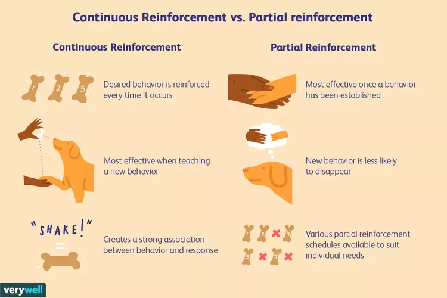

<h1 align="center" style="color:Navy;">Organizational Behaviour</h1>
<h2 align="center" style="color:DarkRed;">Week-4 (Learning & Attitudes)</h2>

#### Table of Contents

> A relatively permanent change in behaviour occurring as a result of experience. 
> Learning leads to change in behaviour. 
> The change in behaviour is not temporary. 

- Theories on Learning
    - Behaviouristic theories
        1. Classical conditioning
        2. Operant conditioning
    - Cognitive Theories
    - Social learning theory
- Using Learning Principles in Training

## <db>Theories on Learning</db>

### <dg>Classical Conditioning (Ivan Pavlov - Dog Experiment)</dg>

| Behaviour | Stimulus Type | Stimulant | Response Type |
|---------------------|------------------------------|--------------------|------------------|
| Normal Behaviour |Ring Bell -> No Salivation | Give Food -> Dog Salivates | 
| Before Conditioning | Neutral Stimulus (Ring Bell) | No Food  |Dog (No Salivation)|
| During Conditioning | Neutral Stimulus (Ring Bell) | Unconditioned Stimulus (Give Food)| Unconditional Response (Dog Salivates)|
| After Conditioning | Conditioned Stimulus (Ring Bell) | Even No Food | Conditioned Response (Dog Salivates)|

**Example:**  Phobias, Childhood Tramua

- Fear of Water or Fire or Dog.

### <dg>Operant Conditioning</dg>

- Also known as Instrutmental Conditioning  

- **Law of effect (Thorndike):** behaviours which are followed by desirable consequences will be strengthened and those leading to undesirable consequences will be weakened.

It's a core concept in behavioral psychology, originally developed by B.F. Skinner.\
Here's a breakdown of the key elements:

#### 1. <smb>Reinforcement:</smb>
This involves increasing the likelihood of a behavior by following it with a pleasant outcome.

- **Positive Reinforcement:** Adding a rewarding stimulus after the behavior, e.g., giving a dog a treat for sitting on command.
- **Negative Reinforcement:** Removing an unpleasant stimulus after the behavior, e.g., turning off a loud noise when a rat presses a lever.

#### 2. <smb>Punishment:</smb>
This involves decreasing the likelihood of a behavior by following it with an unpleasant outcome.

- **Positive Punishment:** Adding an unpleasant stimulus after the behavior, e.g., scolding a child for misbehaving.
- **Negative Punishment:** Removing a rewarding stimulus after the behavior, e.g., taking away a toy when a child acts out.

#### 3. <smb>Extinction:</smb>
This occurs when a behavior that was previously reinforced is no longer reinforced, leading to a decrease in that behavior over time.

#### 4. <smb>Schedules of Reinforcement:</smb> 
Reinforcement Schedules Are Used to Strengthen Specific Behaviors 

a. Continuos Reinforcement:
> Continuous reinforcement schedules are most effective when trying to teach a new behavior.\
These schedule denote a pattern in which every narrowly defined response is followed by a narrowly defined consequence.

b. Partial reinforcement: (Reinforce a behaviour for a time period, then it will continue)
- **Fixed-Ratio Schedule:** Reinforcement is given after a set number of responses.
- **Variable-Ratio Schedule:** Reinforcement is given after an unpredictable number of responses, leading to high response rates (e.g., gambling).
- **Fixed-Interval Schedule:** Reinforcement is given after a set period, leading to increased behavior as the time for reinforcement approaches.
- **Variable-Interval Schedule:** Reinforcement is given at unpredictable time intervals, resulting in steady response rates.

|  Partial Schedule | Timing of Reinforcement | Response Rate |
| ----------------- | ----------------------- | ------------- |
| **Fixed-Interval (FI)** | After a specified amount of time | High near end of interval, but slower directly after delivery of reinforcer|
| **Variable-Interval (VI)** | After an unpredictable amount of time | Slow, steady|
| **Fixed-Ratio (FR)** | After a specified number of responses | High, steady |
| **Variable-Ratio (VR)** | After an unpredictable number of responses | High, steady |

Operant conditioning is widely used in various settings, including education, therapy, animal training, and behavior modification programs.

<r>**Which method is better in operant conditioning to shape someone's behaviour?**</r>

**Using Punishment** is a very easy way to reinforce a one's behaviour. But it is not sustainable in a long run, many other times it leads to harmful effects.

- Most used,least understood and badly administered.
- Punishment is a complex phenomenon.
- First warn people, then give punishment.
- Should be carefully defined and used.
- Punishment can increase negative behaviour by paying attention to them.
- Punishment can lead to anxiety, aggression, depression, hatred etc.
- It's a lose-lose approach.
- Based on threat and fear.
- Use red-hot-stove approach
    - Warn
    - Prompt (Punish immediately, not later)
    - Consistent
    - Impersonal (Everyone gets punished no exemption)
    
<smo>**Punishment should be least preferred method in shaping one's behaviour.**</smo>

## <dg>Cognitive Learning Theories</dg>

### <smb>Latent Learning:</smb>
- **Definition:** Latent learning refers to knowledge that is acquired without immediate reinforcement and is not immediately observable in behavior.\
This learning becomes apparent only when there is an incentive to demonstrate it.
- **Example:** If a rat explores a maze without any reward, it may not immediately show that it has learned the layout of the maze.\
However, if food is later placed at the end of the maze, the rat will quickly navigate to the food, demonstrating that it had learned the layout all along.

### <smb>Cognitive Map:</smb>
- **Definition:** A cognitive map is a mental representation of the physical environment.\
This concept was introduced by Edward Tolman, who suggested that individuals and animals create mental maps to navigate and understand their surroundings.
- **Example:** When you navigate your way home, you're using a cognitive map of the area.\
Even without consciously thinking about it, you know the turns and landmarks to guide you.

### <smb>Expectancy Theory:</smb>
- **Definition:** Expectancy Theory is a cognitive theory of motivation that suggests individuals are motivated to act based on the expected outcomes of their actions.\
The theory posits that people make decisions by evaluating the likelihood of a desired outcome and the value they place on that outcome.
- **Example:** A student believes that if they study hard (expectation), they will get a good grade (desired outcome).\
Because they value good grades, they are motivated to study more.\
If this expectation is consistently met with good results, the motivation to continue studying will be reinforced.

## <dg>Observational Learning</dg>
- Also known as modelling or vicarious learning
- Learning through observing others experience.
- Steps:
    - Paying attention
    - Good retention
    - Behavioural reproduction
    - Motivation

- **Example:** Children (5-13) mimic the SuperHeroes Characters, Teens(13-19) reproduce the Heros Fashion, attitude, and hair style.

## <dg>Using Learning Principles in Training</dg>

- Motivate participation
- Periodical training programs
- Provide opportunities to transfer knowledge
- Provide feedback
- Role models and mentoring

## <db>Attitudes</db>

### <dg>Attitudes</dg>

- Attitudes influence our behaviour.
- Evaluative statements towards objects, people or events.
- A tendency to react in a certain way.
- Attitudes are usually for or against something or somebody.

### <dg>Key elements</dg>
- Values and attitudes
- Strength of similar attitudes
- 3 Components of attitudes
    - Cognitive (belief, opinion, knowledge, information etc)
    - Affective (emotional/feeling) - this is more powerful
    - Behavioural (intentions)
    
    Affective component and other attitude-related stimuli.

### <dg>Attitudes and values</dg>

- Values are similar to attitudes but they are deep rooted and permanent in nature.
- Values are most central to the core of a person
- Values: the concept of the desirable, and internalized\
criterion or standard of evaluation a person possesses.
- Values provide a standards of competence and morality
- Values are fewer in number than attitude 
- Values are relatively permanent and resistant to change
- Values transcend specific objects, situations or persons
- **Examples:** Simplicity, Loyality, Honesty.

### <dg>Attitudes and Opinion</dg>

- Sun rises in the East (Fact or Info).
- Tomorrow it might rain (Opinion or Assumption).
- Opinion is primarily cognitive (Subjective to a person)
- Opinion is specific
- Attitudes influence opinions

### <dg>Attitudes, beliefs and ideology</dg>

- Belief is a judgment about something.
- Beliefs are mostly emotionally neutral.
- Organized beliefs lead to ideologies.
- Attitudes and prejudice

### <dg>Characteristics of attitudes</dg>

- **Valence:** Intensity / magnitude / degree of favorableness or unfavourableness.
- **Multiplexity:** number of elements constituting the attitude
- **Relation to needs:** the purpose it serves
- **Centrality:** importance of the object

### <dg>Attitude formation</dg>

- We are not born with attitudes, when we are born, we are like a clean slate.
- **Sources:**
    - Personal experiences
    - Association
    - Family
    - Peer group and society
    - Models
    - Institutional factors

### <dg>Attitude measurement</dg>

#### <smb>Thurstone's Scale:</smb>
   - **Definition**: Thurstone's scale, also known as the **equal-appearing intervals scale**, is a method of measuring attitudes that involves presenting statements about a particular issue. Each statement is assigned a scale value based on how favorable or unfavorable it is perceived to be.
   - **Example**: Respondents indicate agreement or disagreement with each statement. The attitude score is calculated by averaging the scale values of the agreed-upon statements.

#### <smb>Likert's Scale:</smb>
   - **Definition**: The Likert scale is a widely used method for measuring attitudes by asking respondents to indicate their level of agreement or disagreement with a series of statements on a multi-point scale (typically 5 or 7 points).
   - **Example**: A survey might include a statement like "I enjoy working in teams," with response options ranging from "Strongly Disagree" to "Strongly Agree." The overall attitude is assessed by summing or averaging the scores.

#### <smb>Bogardus's Social Distance Scale:</smb>
   - **Definition**: The Bogardus Social Distance Scale measures the degree of closeness or distance an individual feels toward members of various social, ethnic, or racial groups. It gauges the willingness of people to participate in social relations with members of different groups.
   - **Example**: A respondent might be asked how comfortable they would be with a member of a particular group as a neighbor, coworker, or family member through marriage. The responses indicate their social distance.

#### <smb>Guttman's Scale:</smb>
   - **Definition**: The Guttman scale, also known as the **cumulative scale**, is used to measure attitudes by presenting a series of statements that are ordered by difficulty or intensity. Agreement with a statement implies agreement with all previous, less intense statements.
   - **Example**: If someone agrees with the most intense statement, such as "I would protest against this policy," they are also assumed to agree with all milder statements like "I disagree with this policy" or "I would sign a petition against this policy."

#### <smb>Projective Tests:</smb>
   - **Definition**: Projective tests are indirect methods of assessing attitudes, beliefs, and emotions by presenting ambiguous stimuli and asking respondents to interpret them. The idea is that individuals project their own attitudes or feelings onto the ambiguous stimuli.
   - **Example**: The Rorschach Inkblot Test is a famous projective test where respondents describe what they see in a series of inkblots. Their interpretations are analyzed to infer underlying attitudes and emotions.

**Keyissues:**
- Open ended Vs closed ended questions
- Subjectivity in response
- Social desirability effect
- Sampling **Exa:-** Evalution of whole country based on 100 responses is bad.

## <db>Cognitive Dissonance<db>

**Cognitive Dissonance** is a psychological theory developed by Leon Festinger in 1957. It refers to the mental discomfort or tension that arises when a person holds two or more contradictory beliefs, values, or attitudes simultaneously or when their behavior conflicts with their beliefs or values.

#### Key Points:
- **Inconsistency**: Cognitive dissonance occurs when there is a lack of harmony between beliefs, attitudes, or behaviors. For example, if someone believes that smoking is harmful but continues to smoke, they may experience dissonance.
  
- **Discomfort**: The dissonance creates psychological discomfort, which people are motivated to reduce. The intensity of the discomfort depends on the importance of the conflicting beliefs or behaviors.

- **Reduction**: People typically reduce dissonance by changing one of the conflicting beliefs, acquiring new information to justify the behavior, or reducing the importance of the conflicting cognition.

Cognitive dissonance is a powerful motivator for behavior change and can explain why people sometimes alter their attitudes or actions to align with each other.

### Changing attitudes
- Providing information
- Reinforcing attitudinal change
- Providing opportunities to explore new situations

## <db>Attitudes at Work Place</db>

### <dg>Job satisfaction</dg>

- Importance of job satisfaction
- **Determinants of job satisfaction**
    - Mentally challenging work
    - Equitable rewards
    - Supportive working conditions
    - Supportive colleagues
    - Personality-job fit
    - Personal characteristics

### <dg>Organizational commitment</dg>

- A belief in and acceptance of the organization’s goals
- A willingness to exert considerable effort on behalf of the organization
- Desire to remain within the organization

### <dg>Prejudice</dg>

- Prejudgment - Without knowing completely, we judge early.
- Organizational demography (composition of the workforce) plays a major role.
- Minority condition
- Normality Vs abnormality
- Prejudice and discrimination

### <dg>Overcoming discrimination</dg>

- Diversity management
- Affirmative action plans
- Sensitivity training

[What do you do when someone just doesn't like you? | Daryl Davis | TEDxCharlottesville](https://www.youtube.com/watch?v=Y4gly9n9RBo)

