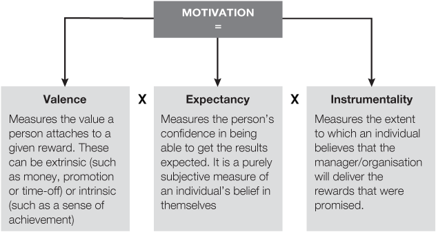
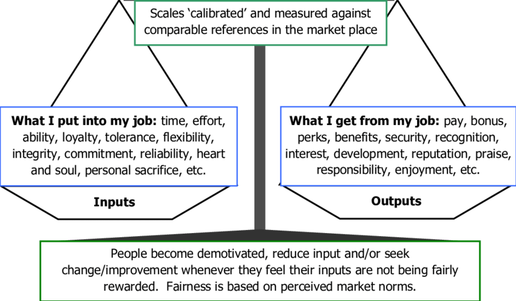
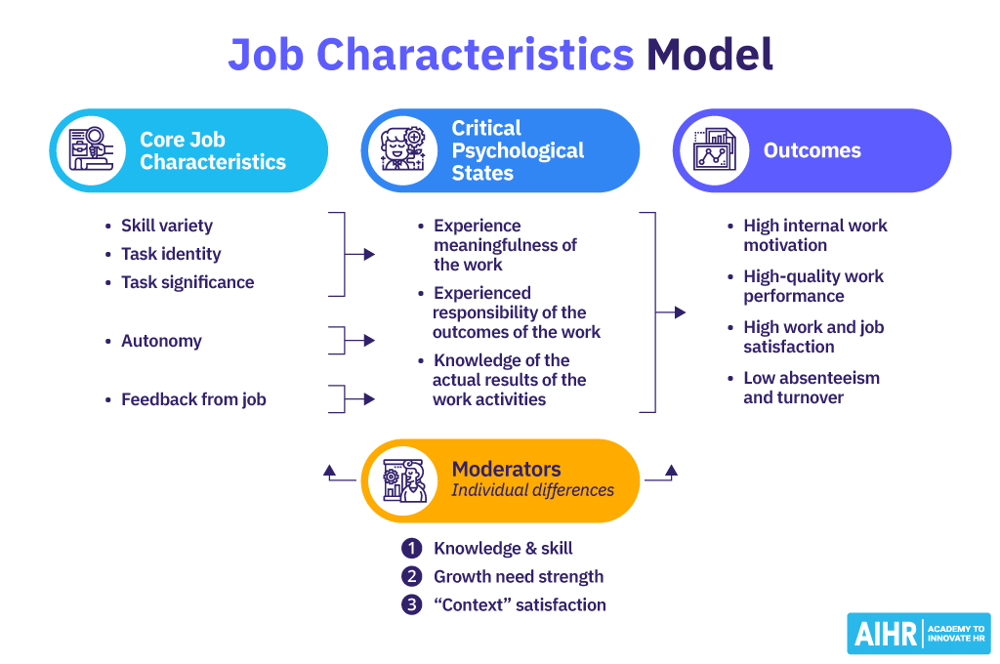

<h1 align="center" style="color:Navy;">Organizational Behaviour</h1>
<h2 align="center" style="color:DarkRed;">Week-6 (Motivation For Employees)</h2>

- **How to make the people work better?**
    - Money is a very powerful motivator.
    - Money can drive people to work better.
    - But it is not just money which motivates people, there are other things too.
    - **Exa:- Interesting Job, Good Cause, Environment, ...**


- **Definition:-** Motivation refers to the internal or external factors that stimulate people to act in a certain way or achieve specific goals.There are two main types of motivation:
    - **Intrinsic Motivation:** This type of motivation comes from within an individual.
    - **Extrinsic Motivation:** This type of motivation is driven by external factors or rewards

- **Or** simply, Willingness to exert high levels of effort to reach a goal.\
**Motive (Reason):** force that pushes you fowards a goal.
    - **Student:** Need good marks to get good grades or for placement or to be 1st in class or for parents or for scholarship, .... Each student has different motives to get good marks.

## <g>The Basic Motivation Process</g>

 NEEDS (Lack of something) —> DRIVES (Behaviour or action for that need) —> INCENTIVES (Final goal or Achivement)

- **Psychological Needs** are internal and relate to an individual's mental and emotional well-being, such as autonomy, competence, relatedness, and self-esteem.

- **Sociological Needs** are external and relate to an individual's social interactions and roles within society, such as belonging, social recognition, social support, and cultural identity.

- Psychological and Sociological Needs are complex and inter-related.

## <g>Characteristics of Needs</g>

- Dominant need dominates behaviour
    - **Exa:** If a person is kept in cell for 10 days without food, then need for food overtakes getting out of the cell.

- Satisfied needs ceases to influence behaviour
    - **Exa:** After eating a meal and feeling full, the need for food is satisfied and the person no longer focuses on eating.

- Needs never cease to exist
    - **Exa:**  Even if someone has just eaten, the need for food will return after a few hours. Basic needs like food, water, and sleep always come back, regardless of how often they are satisfied.

- Needs are recurrent in nature
    - **Exa:**  A person may feel the need for social interaction daily. They might spend time with friends in the evening, but after some time alone, they will again feel the need to socialize.

- All of us have needs
    - **Exa:** Everyone, regardless of their background or status, needs water to survive. Whether a wealthy executive or a student, every person needs to drink water to maintain their health.


## Types of motives

- **Primary motives** These are biological - unlearnt and physiological - like a baby need milk (poor family needs).
- **General motives** Curiosity, paternal, manipulative activity (middle class family needs).
- **Secondary motives** These are learnt from society - security, affiliation, achievement, status etc - like a grown-up need watch or car (rich family needs).


## Psychological motives

- **Power motive:** the desire to control things
- **Achievement (proving themselves) motive:** 
    - Moderate risk taking (They always pre-plan or be early)
    - Need for immediate feedback (They are open for feedback)
    - Satisfaction (They always try to do their best)
    - Preoccupation with the task (They complete their work at any cost)
- **Affiliation motive:** need to be part of a group (like getting into Harvard or a job in MAANG companies)


## Intra-personal conflict (Negative factors) as a motive

- **Role conflict** (**Exa:** A team leader has to do his work and manage the team members work - pushing yourself)
- **Goal conflicts** (There are 2 options in front of you, you have to choose one. **Exa:** You have to watch a movie and a cricket)
    - Approach - Approach (You like both goals)
    - Avoidance - Avoidance (You don't like both goals, but you watch bad movie to avoid cricket match)
    - Approach-Avoidance (You like one goal and don't like other goal)
- **Frustration** (**Exa:** If one thing stops you from going forward, you will find another way to reach your goal)

## <r>Why money does not to be considered as a sole motivator?</r>

- Money can restrict extra-role performance.
    - **Exa:** Once you gave an employee money for saving resources in office like (turing off fans, lights, AC)\
     in hope getting the same next time, he will do the same thing. If you don't give money.\
    It will disappoint him and he won't do such things from next time onwards.\
    Intrinsic motivation comes down, if we attach external rewards to such behaviour.
- Money is not always the first choice. 
    - **Exa:** Giving money for everything is bad approach, a token of apprecation is good.
- Nature of the work matters.
    - **Exa:** For a young fresher, money that matters. For a mid-level employee, promotion that matters.\
    For a Senior employee, promotion that matters. For a Experienced employee, nothing that matters.
- Profit sharing and performance bonuses

**<dg>Money should create a sense of belongingness and also sense of fairness, only then it will work as a sustainable motivator in work context.</dg>**

# <dr>Theories of Motivation</dr>
 - It provide different perspectives on understanding what drives human behavior and how motivation occurs.

- **Content Theories** identify what motivates individuals by focusing on specific needs or factors.\
(e.g., Maslow's Hierarchy, Herzberg’s Two-Factor Theory).

- **Process Theories** explain how motivation occurs through cognitive processes and decision-making.\
(e.g., Expectancy Theory, Equity Theory, Goal-Setting Theory).

# <b>Content Theories</b>

## <dg>Maslow's Hierarchy of Needs</dg>
- **<smb>What it is:</smb>** Maslow proposed that people have five levels of needs: physiological, safety, social (belongingness), esteem, and self-actualization. People are motivated to fulfill basic needs before moving on to higher-level needs.
- **<smb>Example:</smb>** An employee first seeks job security (safety needs) before seeking social connections with coworkers (social needs) and eventually aiming for a promotion (esteem needs).

```
                             /\                    ^
                            /  \                   |
                           /    \                  |
                          / Self \                 |
                         / Actual \                |
                        / -ization \               |
                       /------------\              |
                      /              \             |
                     / Esteem, Needs  \            |
                    /   Self-esteem,   \           |
                   / Recognition, Status\          |
                  /----------------------\         |
                 / Social Needs, Sense of \        |
                /    belonging, Love       \       |
               /----------------------------\      |
              /   Safety Needs, Security,    \     |
             /          Protection            \    |
            /----------------------------------\   |
           / Physiological Needs, Hunger, Thirst\  |
          /______________________________________\ |
```

**What motivates you at work?**

1. An interesting job
2. A good boss
3. Recognition and appreciation for the work I do
4. The opportunity for advancement
5. A satisfying personal life
6. A prestigious or status job
7. Job responsibility
8. Good working conditions
9. Sensible company rules, regulations, procedures, and policies
10. The opportunity to grow through learning new things
11. A job I can do well and succeed at
12. Job security

Hygiene Factors: 2, 5, 6, 8, 9, 12\
Motivational Factors: 1, 3, 4, 7, 10, 11

## <dg>Herzberg's Two-Factor Theory</dg>

- **<smb>What it is:</smb>** Herzberg suggested that job satisfaction and dissatisfaction are influenced by two different sets of factors: hygiene factors (such as salary, job security, and working conditions) that prevent dissatisfaction, and motivators (like recognition, responsibility, and personal growth) that encourage job satisfaction.
- **<smb>Example:</smb>** An employee may not be dissatisfied with their job if they have a good salary and a comfortable office (hygiene factors), but they are truly motivated and satisfied when given more responsibility and recognition for their work (motivators).


```
|-----------------------------------------------------------------|
|                                                                 |
| Area of                   MOTIVATORS            Motivators      |
| satisfaction         ^ Achievement              influence level |
|                      | Recognition              of satisfaction |
|                      | Responsibilty                            |
|                      | Work itself                              |
|                      | Personal growth                          |
|                                                                 |
|-----------------------------------------------------------------|
|                                                                 |
| Area of                   HYGIENE              Motivators influ-|
| disssatisfaction     ^    FACTORS              ence level of    |
|                      |                         disssatisfaction |
|                      | Working conditions                       |
|                      | Pay and Security                         |
|                      | Company policies                         |
|                      | Supervisors                              |
|                      | Interpersonal                            |
|                      | relationships                            |
|                                                                 |
|-----------------------------------------------------------------|
```

## <dg>Alderfer's ERG Theory</dg>

- **<smb>What it is:</smb>** Alderfer simplified Maslow's hierarchy into three core needs: Existence (basic survival needs), Relatedness (social and relationship needs), and Growth (personal development needs). Unlike Maslow, Alderfer believed these needs can be pursued simultaneously.
- **<smb>Example:</smb>** A person may be motivated to work overtime (existence) while also seeking friendship with colleagues (relatedness) and pursuing additional training opportunities (growth).

```
|-----------|           |-------------|           |----------|
|           | ========> |             | ========> |          |
| Existence |           | Relatedness |           |  Growth  |
|  Needs    | <-------- |  Needs      | <-------- |   Needs  |
|-----------|           |-------------|           |----------|

                     =========> Satisfaction -> Progression
                     <--------- Frustration  -> Regression

```

## <dg>McClelland's Theory of Needs</dg>

- **<smb>What it is:</smb>** McClelland identified three specific needs that motivate people: the need for achievement (nAch), the need for affiliation (nAff), and the need for power (nPow). Each person has a dominant need that influences their behavior.
- **<smb>Example:</smb>** An individual with a high need for achievement (nAch) might be highly motivated to complete challenging projects and gain recognition for their successes.<br><br>


# <b>Process Theories</b>

## <dg>Expectancy Theory (Vroom):</dg>

- **<smb>What it is:</smb>** Vroom's Expectancy Theory suggests that motivation is based on an individual’s expectation that a certain level of effort will lead to a desired performance outcome, and that this performance will result in a valued reward. The formula is often summarized as: Motivation = Expectancy x Instrumentality x Valence.
- **<smb>Example:</smb>** An employee will be motivated to work hard if they believe their efforts will result in high performance (expectancy), that high performance will be recognized (instrumentality), and that the recognition (e.g., a bonus) is desirable (valence).<br>




## <dg>Equity Theory (Adams):</dg>

- **<smb>What it is:</smb>** Adams' Equity Theory proposes that individuals are motivated by fairness. People compare their input-output ratios (effort and reward) with those of others. If they perceive an imbalance, they are motivated to restore equity, either by altering their inputs or by seeking adjustments in rewards.
- **<smb>Example:</smb>** An employee who feels underpaid compared to their peers might reduce their effort at work or negotiate for a salary increase to restore perceived fairness.<br>




## <dg>Goal-Setting Theory (Locke and Latham):</dg>

- **<smb>What it is:</smb>** Locke and Latham's Goal-Setting Theory posits that specific and challenging goals, along with appropriate feedback, enhance motivation and performance. The theory emphasizes the importance of setting clear, achievable goals and providing feedback on progress.
- **<smb>Example:</smb>** A manager sets a clear goal for a team to increase sales by 15% in the next quarter and provides regular updates and encouragement, motivating the team to strive towards that target.

## <dg>Self-Determination Theory (Deci and Ryan):</dg>

- **<smb>What it is:</smb>** Self-Determination Theory (SDT) focuses on the degree to which an individual's behavior is self-motivated and self-determined. The theory highlights the importance of autonomy, competence, and relatedness as key factors in fostering intrinsic motivation.
- **<smb>Example:</smb>** An employee feels motivated when they have the freedom to choose how to complete a task (autonomy), feel capable of achieving it (competence), and have supportive relationships with coworkers (relatedness).


# <b>Organizational Justice Climate</b>
>Organizational Justice Climate refers to employees' collective perceptions of fairness within an organization. It reflects how fair employees believe the organization is in terms of distributing resources, implementing procedures, and interacting with them.

**If there is no justice, it will bring chaos.**

### <do>Distributive Justice</do>
- **Definition:** Distributive justice is concerned with the perceived fairness of the outcomes or distribution of resources and rewards among employees. It focuses on whether employees believe that the allocation of rewards, such as pay, promotions, or recognition, is fair based on their contributions, efforts, or needs.\
**OR** Simply, it focuses on the fairness of the outcomes .
- **Example:** An employee feels a sense of distributive justice if they believe their salary and bonuses are fair compared to their coworkers who have similar roles and performance levels.

### <do>Procedural Justice</do>
- **Definition:** Procedural justice relates to the perceived fairness of the processes and methods used to determine the distribution of resources and outcomes. It focuses on how decisions are made rather than the outcomes themselves, emphasizing the importance of consistency, transparency, and impartiality in decision-making procedures.\
**OR** Simply, it emphasizes the fairness of the processes used to determine those outcomes.
- **Example:** An organization that has a transparent and consistent process for promotions, where all employees understand the criteria and have a chance to provide input, would be seen as having high procedural justice.

### <do>Interactional Justice</do>
- **Definition:** Interactional justice focuses on the quality of interpersonal treatment that employees receive from decision-makers. It encompasses two components: interpersonal justice, which relates to the respect and dignity with which employees are treated, and informational justice, which concerns the adequacy and transparency of explanations provided to employees regarding decisions.\
**OR** Simply, it centers on the fairness of the interpersonal treatment and communication employees receive during decision-making processes.
- **Example:** An employee who is laid off but receives a thorough explanation of the reasons for the decision, delivered in a respectful and empathetic manner, will feel a sense of interactional justice.

# <b>Job Characteristics Model</b>
> The **Job Characteristics Model (JCM)** suggests that specific job characteristics can increase employee motivation, satisfaction, and performance. The model identifies five core job characteristics that influence three psychological states, leading to positive work outcomes.




1. **<do>Skill Variety</do>**:
   - **Definition**: The degree to which a job requires a variety of different activities and skills.
   - **Simple Explanation**: Does the job use different skills and talents? If a job involves different tasks that require different skills (like problem-solving, communication, and technical skills), it is high in skill variety.
   - **Example**: A graphic designer uses creativity, technical drawing skills, and knowledge of design software, which provides high skill variety.

2. **<do>Task Identity</do>**:
   - **Definition**: The degree to which a job requires the completion of a whole, identifiable piece of work.
   - **Simple Explanation**: Does the job allow an employee to complete a task from start to finish? A job with high task identity lets an employee see the result of their work.
   - **Example**: A carpenter who builds an entire piece of furniture from start to finish has high task identity, as opposed to someone who only screws in the legs of a chair.

3. **<do>Task Significance</do>**:
   - **Definition**: The degree to which a job has a substantial impact on other people, inside or outside the organization.
   - **Simple Explanation**: Does the job matter? A job with high task significance makes a meaningful impact on the lives or work of others.
   - **Example**: A nurse caring for patients has high task significance because their work directly affects patients' well-being.

4. **<do>Autonomy</do>**:
   - **Definition**: The degree to which a job provides freedom, independence, and discretion to the employee in scheduling work and determining how to carry it out.
   - **Simple Explanation**: Can the employee decide how and when to do their work? Jobs with high autonomy allow employees to make their own decisions about their tasks.
   - **Example**: A freelance writer who can choose their topics and deadlines has high autonomy.

5. **<do>Feedback</do>**:
   - **Definition**: The degree to which carrying out the job provides clear and direct information about how well the employee is performing.
   - **Simple Explanation**: Does the job provide direct feedback on performance? Jobs with high feedback give employees a clear sense of how well they are doing.
   - **Example**: A salesperson who gets immediate feedback from customers and sales numbers knows if they are performing well or need to improve.

### <r>Summary of How These Characteristics Affect Motivation

<dg><strong>When jobs have these characteristics, employees are more likely to experience meaningfulness in their work (skill variety, task identity, task significance), feel responsible for the outcomes (autonomy), and understand how well they are doing (feedback). These psychological states can lead to higher motivation, job satisfaction, and performance.</strong></dg>


**In the first 6 weeks, we focused on individual dynamics in organizational behavior, such as personality, attitude, emotions, and motivation. Next, we will explore interpersonal dynamics, including communication, group decision-making, and team dynamics.**


<style>
r     { color: Red }
g     { color: Green }
v     { color: Violet }
in     { color: Indigo }
b     { color: Blue }
smb   { color:  #2e86c1} //Semi-Blue
y     { color: Yellow }
o     { color: Orange }
smo   { color:  #d68910 } //Semi-Orange
ma     { color: Maroon }
gr    { color: Gray }
pk    { color: Pink }
lb    { color: LightBlue }
lg    { color: LightGreen }
ly    { color: LightYellow }
lo    { color: LightOrange }
lr    { color: LightRed }
bl    { color: Black }
w     { color: White }
db    { color: DarkBlue }
dg    { color: DarkGreen }
dy    { color: DarkYellow }
do    { color: DarkOrange }
dr    { color: DarkRed }
br    { color: Brown }
cy    { color: Cyan }
te    { color: Teal }
</style>