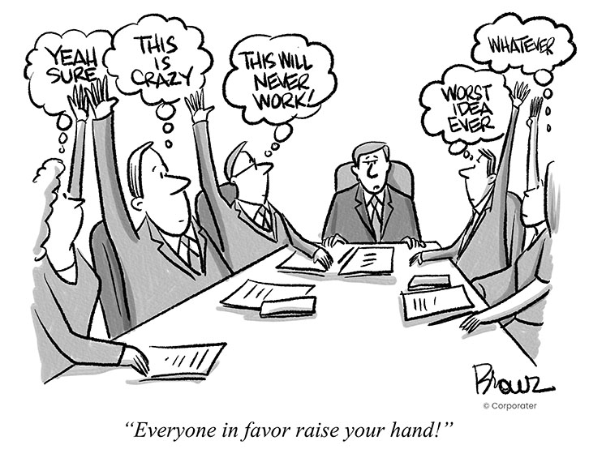
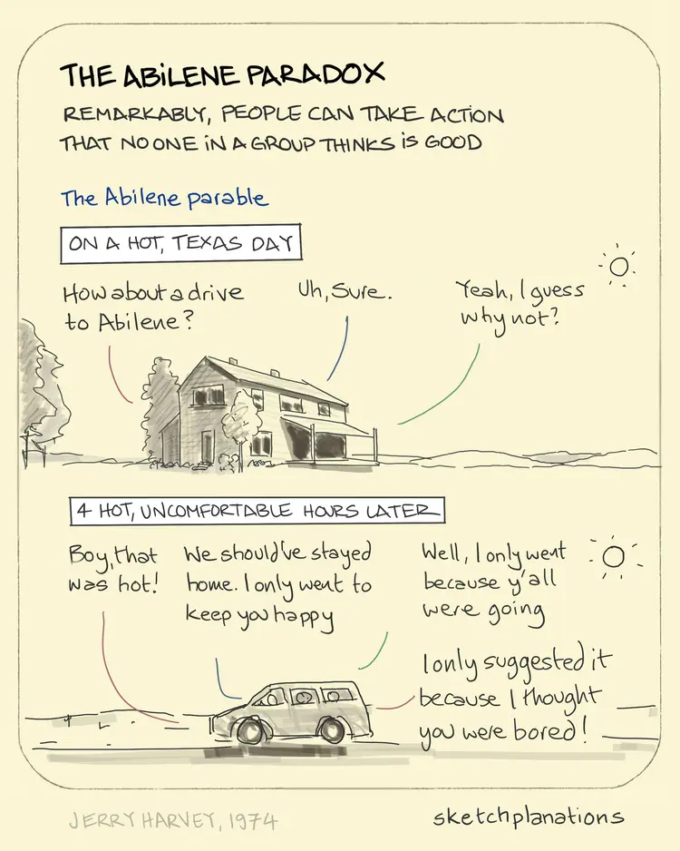

<h1 align="center" style="color:Navy;">Organizational Behaviour</h1>
<h2 align="center" style="color:DarkRed;">Week-9 (Decision Making)</h2>

## <g>Approaches in Decision Making</g>

1. **Rational Approach**  
Making optimal decisions by gathering all possible information and analyzing them rationally.   
*Example:* A company does extensive research before launching a new product.

2. **Bounded rationality**  
Recognizes that people can't always gather or process all information, so they make the best decision within their limits. **OR** Understanding the boundaries of the rational decision making.    
*Example:* A manager picks a supplier after evaluating only the top options to save time.

3. **Non-rational approach:**   
Making decisions under the limitations of information gathering and processing.     
These approaches accept limitations and focus on finding workable solutions rather than perfect ones.
    - **Satisficing approach:** Finding a solution which is satisfactory rather than optimal    
       *Example:* Accepting a job offer that meets basic needs instead of waiting for an ideal one.
    - **Incremental approach:** Making the smallest response possible that will reduce the problem to at least a tolerable level **OR** Solving problems step-by-step rather than all at once.  
       *Example:* A city reduces traffic by gradually adding bike lanes and public transport.
    - **Garbage-can approach:** Behaving in virtually a random pattern in making decisions  **OR**  Making decisions randomly or without clear structure.   
        *Example:* Patting a TV Remote if it doesn't work properly.

## <g>Barriers to Effective Decision Making</g>

1. **Not Accepting the Problem**  
Failing to acknowledge a problem leads to no action being taken.

2. **Complacency**  
Feeling overly comfortable with the status quo, which prevents decision-making. **OR**    
Satisifying with the current state, not worrying about the problem ahead.

3. **Defensive Avoidance**  - Taking a issue as not a problem, it is managable.  
Avoiding the decision by using different tactics:
   - **Rationalization:** Justifying inaction by downplaying the problem. **OR** Taking it as normal in a process.
   - **Procrastination:** Delaying the decision unnecessarily.
   - **Buck Passing:** Shifting responsibility for the decision making to others.

4. **Panic**  
Fear of making wrong decisions, because of huge responsibilty

5. **Not Deciding to Decide**  
Not deciding who has power to make decision call.
   

## <g>Biases in Decision Making</g>

1. **Framing**    
The tendency to make different decisions depending on how a problem or information is presented.    
*Example:* We feel fine in Paying 5% tax, but if it 5 thousand out of 1 Lakh we feel sad.    
In marketing, people use framing.

2. **Prospect theory**    
Decision makers find the prospect of an actual loss more painful than giving up the possibility of the gain. **OR**   
People fear losses more than they value gains, leading to risk-averse behavior.  
*Example:* A person would rather avoid losing $100 than taking a chance to win $150.

3. **Representativeness**   
Judgments are influenced by stereotypes, leading to incorrect assumptions about events.   
*Example:* Assuming a nurse is always a female.

4. **Availability**  
Judging the likelihood of an event based on how easily similar examples come to mind.  
*Example:* After seeing news about plane crashes, people may overestimate the risk of flying.

5. **Anchoring and Adjustment**  
Being influenced by an initial piece of information (the "anchor") and making insufficient adjustments from it, even if irrelevant.  
*Example:* If a car is initially priced at $30,000, a discount to $25,000 may seem like a great deal, even if the car’s true value is less.

6. **Overconfidence**  
Being overly certain about the accuracy of one's decisions or judgments.  
*Example:* A manager might be overly confident in a project’s success, ignoring potential risks.

## <g>Decision Making in Teams - Individual Vs The Group</g>

1. **Best Team Member vs the Team**  
An individual expert may make faster decisions, but a group can combine diverse perspectives for a better overall solution.

2. **Synergy**  
Teams often generate better ideas by building on each other’s input, leading to more creative and effective decisions than individuals alone.

3. **Role of Group Processes**  
Effective communication, collaboration, and conflict resolution within the group are key to making strong, well-rounded decisions.

4. **Role of Leadership**  
A good leader guides the group, encourages participation, and steers discussions toward a decision without dominating the process.

5. **Nature of the Problem**  
Some problems are better solved by individuals (when expertise is crucial), while complex problems benefit from group input.

6. **Risk-Taking in Groups**  
Groups often take more risks than individuals because responsibility is shared (also known as **groupthink** or **risky shift**).

## <g>Decision Making in Teams</g>   

### <smb>General Group Decision Making Techniques</smb>

1. **Orientation**
   - **Define the problem:** Ensure everyone has a shared understanding to avoid biases and miscommunication - To get common understanding about the problem and to avoid common information bias.
   - **Set Goals:** Clarify timelines, processes, and methods to guide the group - Timelines, process and methods.
   - **Plan for the Process:** Establish clear guidelines and milestones for decision-making - Having guidelines and milestones.

2. **Discussion**
   - **Gather Information:** Collect relevant data from all group members.
   - **Identify Alternatives:** Brainstorm multiple solutions.
   - **Evaluate Alternatives:** Weigh the pros and cons of each option.

3. **Decision making**
   - **Choose group solution:** The group agrees on the best solution through consensus or voting.

4. **Implementation**
   - **Adhere to the Decision:** Commit to executing the chosen solution.
   - **Evaluate the Decision:** Assess the effectiveness of the decision after implementation.
   - **Seek Feedback:** Gather input to improve future decisions.

### <smb>Popular Group Decision Making Techniques</smb>

1. **Nominal Group Technique (NGT)**  
This technique involves individuals first generating ideas independently, then coming together as a group to discuss and rank them. It helps prevent dominant voices from taking over and ensures that everyone’s input is considered.

   - **Process:**  
     1. Silent idea generation.  
     2. Group discussion of ideas.  
     3. Vote or rank ideas for decision-making.

2. **Delphi Method**  
A structured method where experts answer questionnaires in multiple rounds. After each round, the facilitator summarizes responses, and participants can revise their answers based on the feedback. This continues until a consensus is reached.

   - **Used for:** Long-term forecasting, expert decision-making.

3. **Ringi Technique**  
A Japanese consensus-building method where a proposal is circulated among group members for feedback. Members provide their input and pass it to the next person. The process continues until consensus is reached without the need for a formal meeting.

   - **Benefits:** Involves everyone, encourages gradual agreement.

## <g>Majority Rule</g>

1. **Level of Preference May Vary**  
While a majority supports a decision, the intensity of support can differ. Some may strongly favor it, while others may agree reluctantly, leading to uneven commitment.

2. **Blocks Creativity**  
Majority rule can stifle creative or innovative ideas, especially if those ideas are proposed by a minority group and get outvoted, even though they might offer better solutions.

3. **Formation of Coalitions or Subgroups**  
Majority voting can encourage the formation of coalitions or subgroups within the team, leading to division or conflict as members compete to sway decisions in their favor.

## <g>Groupthink</g>

**Groupthink** occurs when the desire for harmony and conformity within a group leads to poor or irrational decision-making.  
The group prioritizes agreement over critical evaluation, often resulting in bad decisions.

**Symptoms**

1. **Overestimation**  
   The group becomes overconfident and believes they are invulnerable or always right.
   - *Example:* The group assumes their decision can't fail without critically assessing the risks.

2. **Close-mindedness**  
   The group ignores or dismisses alternative viewpoints or information that contradicts their ideas.
   - *Example:* The team refuses to consider feedback or outside opinions.

3. **Pressures Toward Uniformity**  
   Members feel pressured to conform, suppressing dissenting opinions to maintain group cohesion.
   - *Example:* People hesitate to voice concerns for fear of disrupting harmony or being labeled as disloyal.

**Role of Leader Behavior:**  
The leader's behavior can either encourage or prevent groupthink. A leader who dominates discussions or discourages debate can foster groupthink.  
In contrast, leaders who promote open dialogue, invite diverse opinions, and encourage critical thinking can help avoid it.

## <g>The Abilene Paradox</g>

The **Abilene Paradox** occurs when a group makes a collective decision that no individual actually wants, but each member assumes others support it. This happens due to a fear of conflict or a misguided desire to maintain harmony.

- **Pluralistic Ignorance:**  
   Group members agree to a decision without voicing their true opinions, assuming others want it. No one challenges the idea because they think everyone else is in agreement, even when they are not.

- **Overemphasis on Consensus:**  
   The group focuses so much on achieving consensus that members suppress their real preferences, leading to decisions no one is truly happy with.

## <g>Escalation of Commitment</g>

**Escalation of Commitment** refers to the tendency to continue investing in a failing course of action due to the resources already invested, such as time, money, or effort.

- **Non-Rational Escalation:**  
  People make irrational decisions based on previous rational decisions or to justify actions already taken, even when it's clear that continuing is unwise.  
  *Example:* A company continues funding a failing project because they’ve already invested heavily, despite evidence it won’t succeed.

- **Escalation of Commitment:**  
  The inclination to pour more resources into a losing proposition, hoping to recover past losses.  
  *Example:* An investor puts more money into a declining stock, hoping it will eventually rebound.

- **Sunk Costs:**  
  Costs that have already been incurred and cannot be recovered, yet people irrationally take them into account when making future decisions.  
  *Example:* Staying in a bad relationship simply because of the time already spent together.

### <smb>Factors Influencing Escalation of Commitment</smb>

1. **Nature of the Setback**  
   Minor setbacks may lead individuals to continue investing, believing success is near.

2. **Personal Rewards**  
   The potential for personal gains can motivate continued investment, even in failing projects.

3. **Ego and Reputation**  
   Fear of looking incompetent can drive individuals to stick with poor decisions.

4. **Confirmation Bias**  
   People tend to seek information that supports their beliefs, ignoring evidence against their choices.

5. **Perception of Recovery**  
   If individuals believe recovery is possible, they are more likely to keep investing.

6. **Group Cohesiveness**  
   Strong group bonds can lead members to support a failing course to maintain harmony.

### <smb>Avoiding Escalation of Commitment</smb>

1. **Set Limits**  
   Establish clear criteria for when to stop investing in a project to prevent overcommitment.

2. **Avoid Ambiguity**  
   Ensure that goals and expectations are clear to reduce misinterpretation of progress.

3. **External Reviewers**  
   Involve impartial third parties to evaluate the situation and provide unbiased feedback.

4. **Accept Sunk Costs**  
   Recognize that past investments are gone and should not influence current decision-making.

5. **Manage Emotions**  
   Stay aware of emotional influences and focus on rational analysis to avoid letting feelings drive decisions.

